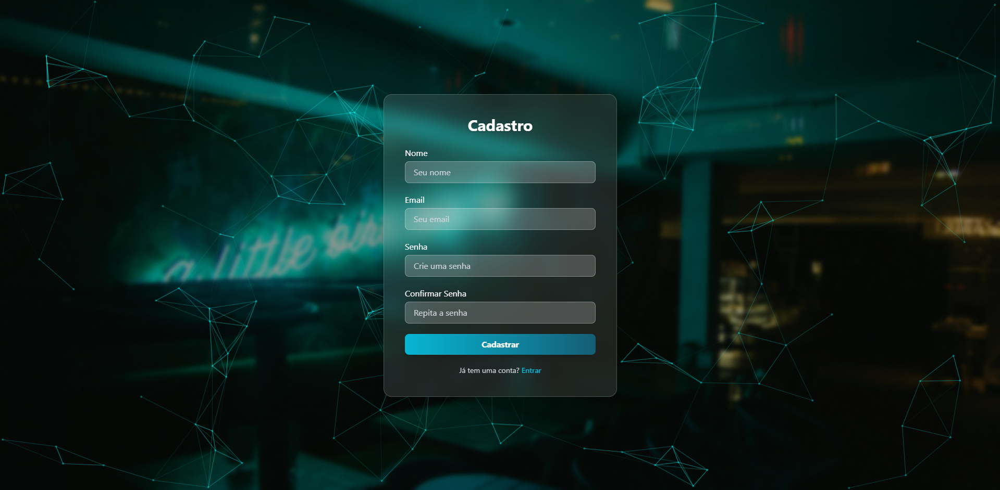
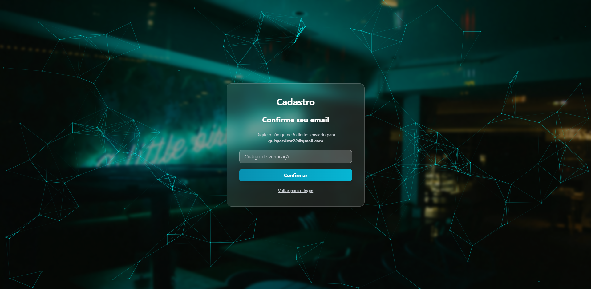
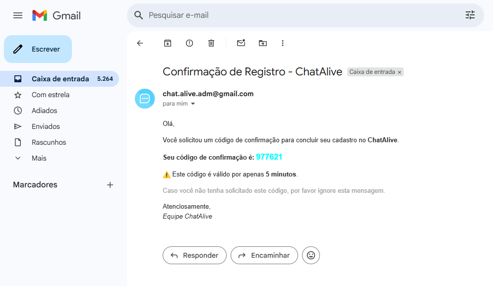
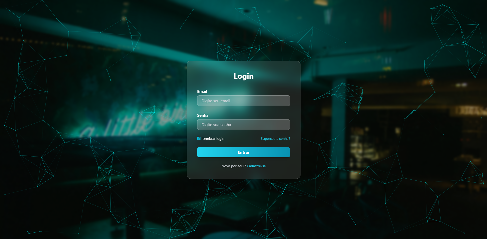
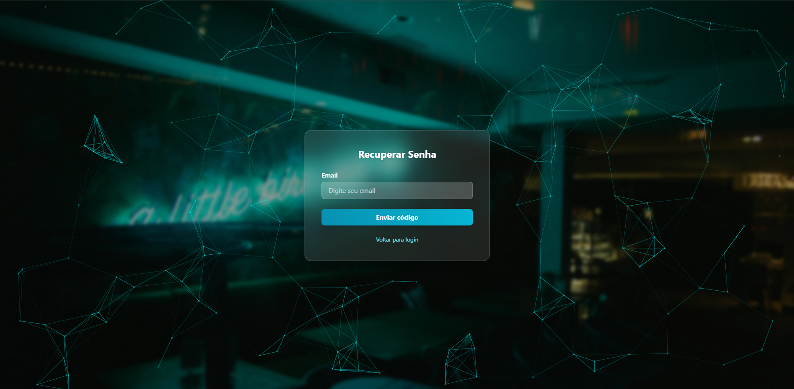
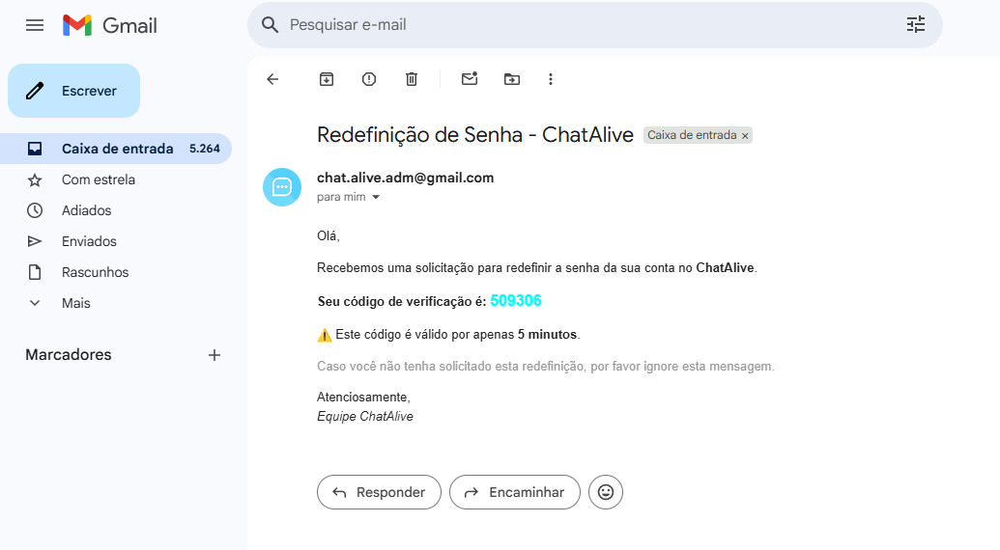
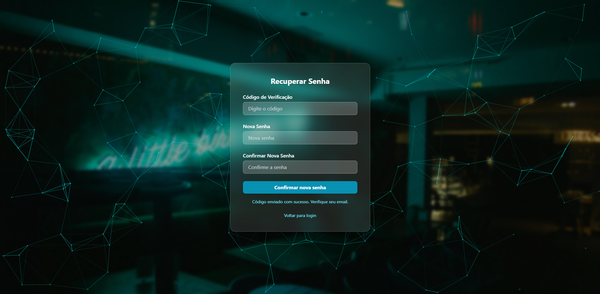

# 🗨️Chat Alive - Plataforma web de comunicação

-Em desenvolvimento...

-Backend JavaSpring para todo esse funcionamento a seguir

-Para mais detalhes do projeto: [projeto no linkedin](https://www.linkedin.com/in/guilherme-brito-souza-santos-49766329b/details/projects/)

-Ou minha publicação no linkedin com video desse cadastro em funcionamento: [minha publicação no linkedin](https://www.linkedin.com/posts/guilherme-brito-souza-santos-49766329b_java-react-springboot-activity-7343464169960005632-JsJf?utm_source=share&utm_medium=member_desktop&rcm=ACoAAEiItPMBGZ6MFmADAKDc1INgrMrxiTEvHkg)

# Cadastro
onde o usuário coloca seus dados para criar uma conta no chatAlive e começar a criar grupos e conversar

# Confirmar código 
Em seguida pede para inserir o código de confirmação recebido por email

# Email de confirmação
Email com código de confirmação formatado em html recebido pelo usuário 

# Entrar
Tudo certo com seu cadastro logo poderá fazer login normalmente e acessar nossa plataforma

# Esqueceu a senha?
onde o usuário coloca seu email e pede para redefinir a senha caso tenha esquecido

# Email com código para redefinir senha
Email que o usuário recebe para redefinir senha

# Definir nova senha
Onde o usuário coloca o código recebido e a nova senha

